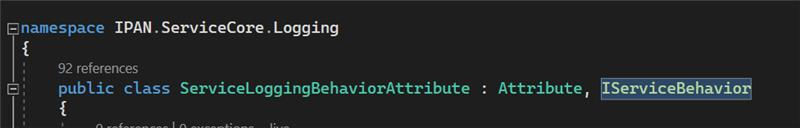

# `\Source\IPAN.ServiceCore\Logging\LoggingOperationInvoker.cs`

dakle taj IServiceBehavior to je u stvari WCF/SOAP ujdurma




to je WCF SOAP "deep legacy" ... soap vraca poruku kroz soap ... soap nema http status codes ... 

koliko kapiram LoggingOperationInvoker taj trace begin i trace end pisu dosta po fajlovi a sve su to blocking operations ...

drugo mislim da se to sve izdesava za svaki metod jel u konstruktoru zove start operations / stop operation 

dodatno tu je i neko (neuko) kao merenje itd ...

onda prirodno tu ima dosta reflection sto je u doba 4.7.2 bilo vrlo sporo; AFAIK.

i na kraju slag na tortu
```C#
public bool IsSynchronous
{​
    get {​ return true; }​
}​
```
treba nam nova implementacija koja ce da vrati false  da skratimo prichu